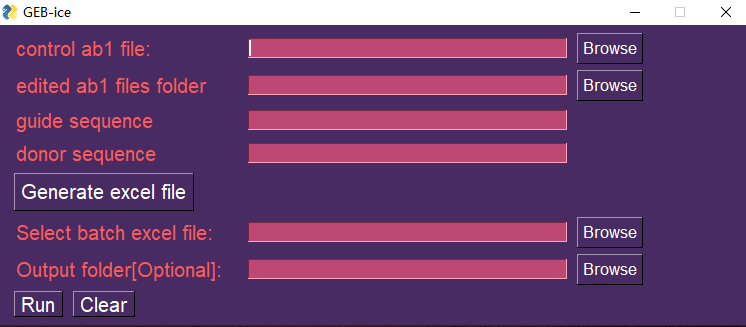

# geb_ice
A simple GUI wrapper for the `synthego ice` program for the windows x86_64 user to analysis the sanger sequence INDEL rate. One good thing about the `synthego ice` is the program can figure out the parameters itself so all you need is to provide the control ab1 files and edit ab1 files and the guide sequences or the donor sequences in a excel file, then you'll have the analyzed results.

# 1. Usage
Open the GUI progam `geb_ice` and the UI looks like this:

Click the 3th `Browse` to select the excel file to specify the inputs. And click the bottom `Browse` to select the output directory path.

In the `example` folder after you downloaded the program package you can find those example files.

## 1.1 Quick start with a simple example

Provide the program the excel file in this format:

The first column is the index of each sample in this case it's 0, the `Label` column is the sample's name, the `Control File` column is the `ab1` file name for the control sample, the `Experiment File` column is the `ab1` file name for the experiment sample, the `Guide Sequence` column is the guide sequence, the `Donor` column is the donor sequence and it's optional.

You can find this excel file `batch_example_simple.xlsx` in `example` folder of the downloaded progam package

## Caveats

### (1) You must provide the excel file like the above format;

### (2) The ab1 files must be located at the same folder of the excel file.

After the excel file has been prepared properly, click the 3th `Browse` button to select it. Then click the `Run` button to launch the program, if you didn't select the `Output folder` with the bottom `Browse` the `results` folder will be stored at the directory of the input excel file. And of course, you can specify the output path with the bottom `Browse`.

## 1.2 Advanced example
In the `example` folder you can find the `batch_example.xlsx` file:

The format of this excel file is the same but with it you can learn how to process samples with multiple guide sequences just provided multiple guide sequences in a comma separated way and how to process samples with donor sequence.

# 2. Easy way to use
If you have a lot of samples then filling the excel file will be tedious and time-consuming so you can use the `Generate excel file` button to generate the excel file for you.

And before clicking the `Generate excel file` button you should choose one control ab1 file with the first `Browse` button and then tell the program the path of all the rest ab1 files in a same batch, with the 2th `Browse`.

By default, the program will generate the excel file at user's Desktop, you can check this excel file after the generation. If it has been properly generated, specially the guide sequences are correct, then click the `Run` button.

